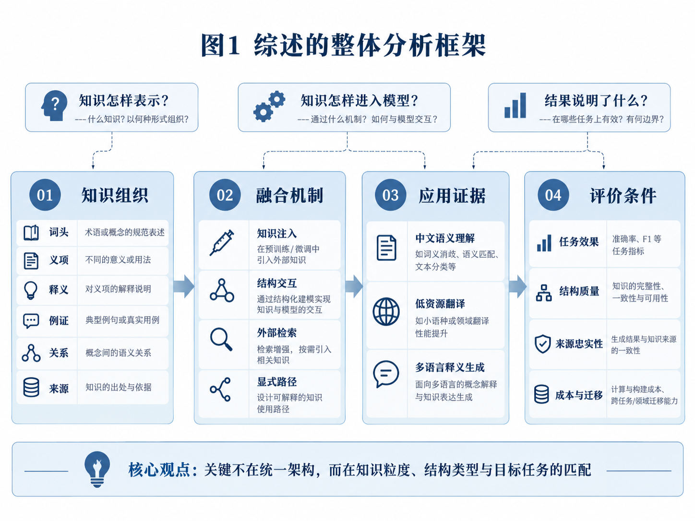
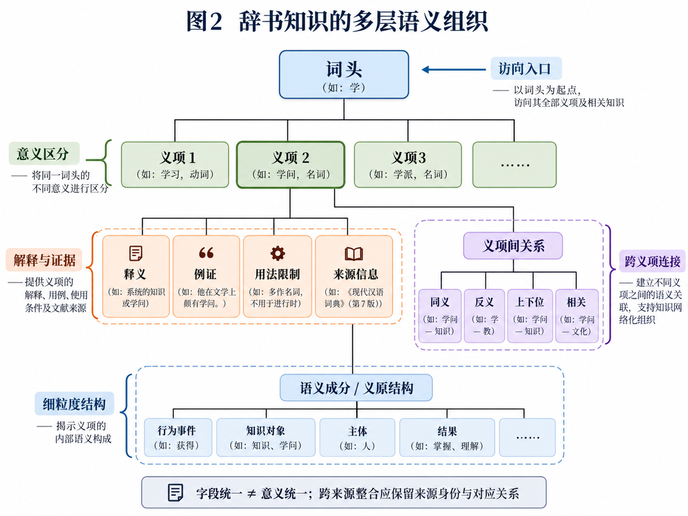
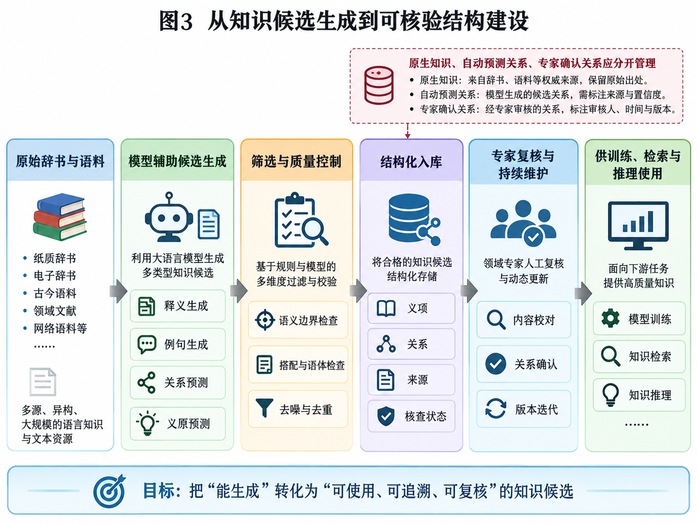
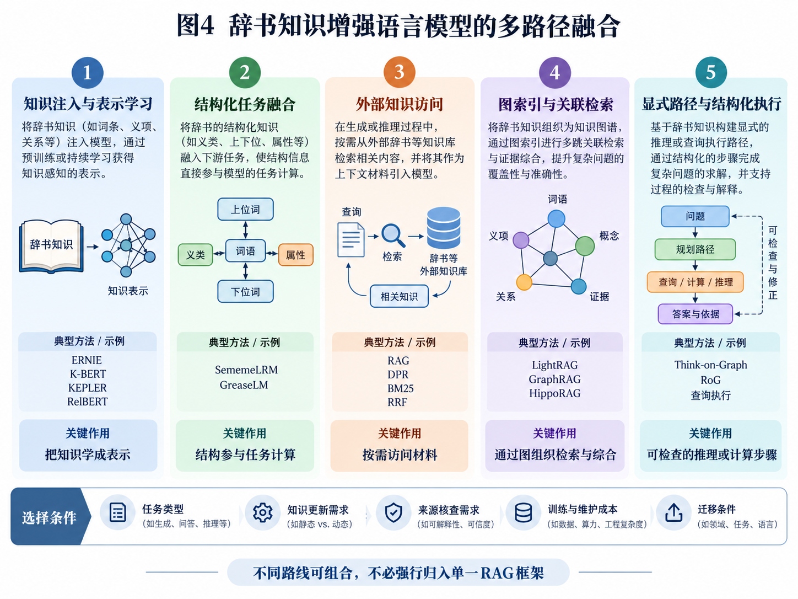
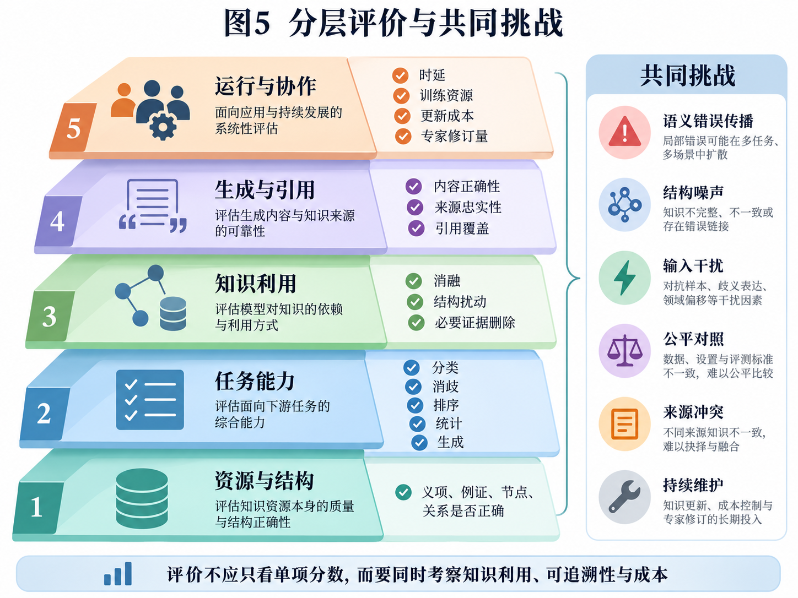

# 辞书知识与语言模型融合研究综述

语义表示、知识注入与推理应用

修正版  |  2026年10月5日

## 摘要

辞书与词汇语义资源把词形、义项、释义、例证和词汇关系变成了可计算的知识，能给语言模型提供一般语料之外的语义约束。围绕这类知识，已有研究走过多条路线：模型辅助知识构建、训练阶段的知识注入、图与语言表示的融合、外部记忆检索，以及显式的路径推理。本文以主题式文献综述的方式，从知识组织、融合机制、应用证据和评价条件四个方面比较代表性研究，并着重讨论结构化义原知识、知识图谱与图检索方法之间的联系和差异。分析表明，融合的关键不在于采用哪种统一架构，而在于让知识的粒度、结构类型与目标任务相匹配。词汇关系与知识补全研究为结构的作用提供了最直接的证据；中文语义理解、低资源翻译和多语言释义生成的研究，则分别说明了资源供给、知识接入方式和迁移条件的影响。不同任务上的收益无法互相替代，回答是否流畅也不能用来推断模型的语义能力。未来研究需要同时检验结构保真度、知识的充分性与干扰、跨来源差异、跨模型与跨语言的适配，以及全流程成本，把重心从增加知识供给转向提高知识利用的有效性和可验证性。

关键词：辞书知识；语言模型；义原；知识注入；知识图谱；语义推理

## 1 引言

### 1.1 研究背景

数字技术不仅改变了辞书的存储和查阅方式，也让辞书不再只是按词头返回固定条目。de Schryver对电子辞书的讨论已经触及检索入口、信息呈现和用户服务等问题，可见辞书数字化的研究意义远不止媒介转换[1]。生成式人工智能又带来了自然语言交互，释义撰写、例句生成和解释调整，这些也成为辞书研究的新议题[2]。于是，辞书知识利用的核心问题慢慢从“能不能找到条目”变成了“能不能根据具体需要，选出并解释可靠的语言知识”。

辞书知识进入模型的方式不止一种。早期的知识增强语言表示研究，尝试在训练或编码时融入实体、关系和文本；结构化义原研究则把词义的内部成分用于任务建模；外部检索、图索引和路径规划是在推理时组织可用的知识。K-BERT、KEPLER、SememeLRM，以及LightRAG和Think-on-Graph，分别代表了这些方向[3–7]。本文关心的是不同融合关系在具体场景中起什么作用、需要什么条件，而非把某种架构在单一基准上的高分当作它普遍有效的证据。

从辞书任务来看，这些路线面对的语义困难是共同的：同一词形有多个义项，同一义项还能拆成作用各异的语义成分；不同辞书的分义粒度和用法说明也未必一致。加大模型参数、输入更多文本、添加更多关系边，这些做法本身都解决不了上述问题。真正值得讨论的是：哪些信息应当保留原文，哪些适合整理成可学习的结构，模型在什么条件下才能用对这些信息。

本文把检索增强生成（retrieval-augmented generation，RAG）看作重要但不唯一的技术路径。Lewis等把参数化的生成模型与非参数化的外部知识结合起来，为检索支持的生成提供了代表性框架[8]。从工程分工的角度看，冻结生成器、在外部维护知识，可以让资源更新与模型更新在一定程度上分开；需要不断更换模型或辞书版本时，这种模块化做法值得重视。但换了生成器之后，提示、证据选择和回答质量仍要重新检验，检索器、重排器和索引也可能要重新适配。所以本文只把可复用的外部知识访问看作有条件的工程优势，不认为RAG必然无需训练、成本更低，或适用于所有任务。

评价同样是各条路线共有的难点。本文纳入的研究分别用关系分类、消歧、翻译、释义生成或引文质量等基准，这些结果还不足以构成一条从知识组织、模型接入、知识利用一直贯通到实际任务的可比证据链。这并不是说该领域没有任何综合基准，只是说单项任务的分数回答不了全部研究问题。因此本文主张建立相互衔接的分层评测：既看语义判断和任务结果，也看知识利用、来源对应和运行成本，而非把异质的指标硬合成一个总分或平均分以显示方案的优越。

### 1.2 研究问题与概念边界

本文围绕三个问题展开。第一，辞书知识应怎样表示，才能保住那些可计算的语义区别？第二，知识通过训练、表示交互、检索或显式推理进入模型，各自解决了什么问题？第三，如何区分任务效果、知识利用能力和可追溯性，并判断方法能否迁移？为此，本文采用“知识对象—接入位置—计算机制—评价目标”的分析框架，逐一考察用了什么知识、知识进入哪个环节、参与了什么计算，以及结果究竟证明了什么。

先界定几组概念。首先，模型辅助辞书编纂和辞书增强模型能力是两个方向。前者包括释义和例句候选生成、义原预测、关系补全；后者既有问答，也有消歧、词汇关系分类、蕴涵判断和翻译。其次，知识图谱（knowledge graph，KG）是一种知识组织方式，不是与RAG并列的某个具体算法：图可以参与训练，也可以充当检索索引或推理环境。再次，模型预训练、任务微调和推理时的知识访问要分开说明，不能把所有用到义原树的方案都笼统叫作“大模型后训练”。

本文所说的“辞书知识”，指来源明确的词头、义项、释义、例证、用法限制和词汇关系，不包括一般的百科知识，也不包括随意拼起来的知识图谱。本文还要区分两类关系：辞书原文明确记录的，和系统自己推断出来的。后者可以当作检索线索或分析假设，但不能因此获得与原始记录同等的证据地位———对这类派生知识，应当分别评价关系判断的准确性、覆盖范围及其对下游任务的影响，并保留可供复核的标注或判断依据。

题目中的“语言模型”既包括以语言表示为主要用途的预训练模型，也包括面向自然语言生成的大语言模型；预训练、任务微调和推理时的知识访问，则属于另行区分的使用阶段。解释释义写得通顺，并不能代表关系分类、词义消歧或蕴涵判断等方面的能力；某一次回答正确，也不足以说明模型具有稳定的语义理解能力。不同任务可以提供互补的证据，但每个任务的输入条件、输出目标和评价尺度都需要明确。

### 1.3 综述范围与文献选择

本文采用主题式、批判性的文献综述方法，选取了辞书知识组织、释义与例句生成、知识注入、图与语言联合建模、外部检索、显式推理和应用评价等方向的42项材料，以2020—2026年的研究为主，必要时回溯基础工作。文献核验依托ACL Anthology、AAAI、NeurIPS与ICLR的论文页面、期刊出版页面、原始技术报告和arXiv，并参照定义建模综述，追踪与词汇语义直接相关的方法。

文献按证据角色区分：直接使用辞书或词汇语义知识的研究，用来讨论相应任务上的效果；一般的知识图谱与语言模型研究，用来比较可迁移的机制；编码规范则用来说明组织原则。正式论文、预印本和社区报告分别著录。本文没有做穷尽式的数据库检索，也没有做元分析；重点文献都核读了方法、结果与局限，部分基础材料只核验了书目信息、摘要或相关定义，因此不对未核读的实验细节作推断。

全文结构如下：第2章说明知识对象及其组织条件，第3章讨论模型如何生成、整理和检验这些知识，第4章比较知识进入模型的各种机制，第5章考察直接应用与迁移证据，第6章把效果和局限转化为评价要求，第7章归纳可继续验证的方向。

## 2 辞书知识的语义组织与表示

### 2.1 从词形、义项到语义成分和关系

常规辞书条目的基本层次可以概括为“词头—义项—释义与例证”：同一词头下排列若干义项，每个义项再关联释义、例句和用法标签。这只是便于分析的概括，不是所有辞书都遵循的固定模板；有些读音、词性或用法说明属于整个词条，由几个义项共享。

辞书知识进入计算过程之前，先要弄清各类信息的作用。词头提供访问入口；义项表达某一来源内部对意义的区分；释义概括意义；例证展示具体用法；用法限制说明语体、领域或其他适用条件。这些信息合起来才能解释一个词，入库后不该变成一堆互相无差别的字符串。比如面对“这个词在该句中是什么意思”这样的问题，词头匹配只能找出候选条目，替代不了对具体义项和语境的判断。

不同的语义资源提供的结构层次也不同。WordNet用同义词集和明确标注的语义关系组织词汇，着眼于具体词义，而不仅是连接词形[9]。HowNet类资源用义原描述词义的构成，OpenHowNet提供了相应的知识和访问工具[10]。于宁等利用义原知识学习词向量，表明结构化知识也可以参与分布式表示的形成[11]。这几项工作分别强调意义关系、意义成分和可计算表示，彼此不能替代。

义项和义原并不是简单的上下级标签。义项是特定资源内部对用法或意义的划分；义原是某种语义描述体系采用的成分单位；义原树中的连接还能表示成分之间的角色关系。所以本文把“义项敏感”理解为能够区分并选出合适的义项，把更宽泛的语义适配落实为对成分组合、关系方向和语境限制的判断。后者无法只靠回答是否通顺来衡量，需要通过关系、消歧和解释任务来检验。

**表1 辞书知识的组织层次与可能用途**

| 组织层次   | 保留的信息          | 可能承担的任务      | 主要风险          |
| ------ | -------------- | ------------ | ------------- |
| 原始条目   | 词头、义项、释义、例证、来源 | 编纂依据、解释核查    | 不同来源的分义粒度不同   |
| 义项内部结构 | 义原、核心成分、层级与角色  | 细粒度表示、关系辨识   | 预测错误或结构简化改变意义 |
| 义项间关系  | 同义、反义、上下位与关联   | 关系分类、知识补全、导航 | 关联被误当等价或逻辑蕴涵  |
| 分布式表示  | 词、义项、关系或文本向量   | 候选发现、表示学习    | 相似度缺少明确的关系类型  |

显式结构凝结着辞书编纂和语言分析中的专家判断，它的作用不应预先限定为文本检索的辅助。义原表示学习和词汇图谱补全的研究，分别在各自任务中检验了结构知识的价值[11,12]。不过专家参与本身并不保证性能：结构有没有用，还要看语义成分准不准、与任务匹不匹配，以及模型怎么用它。

北京大学刘扬等参与的DeFT研究是一个相关的例子。该方法在中文释义生成中引入语素义和构词规则，并结合语境编码完成生成，数据建设由语言学专业人员参与标注和复核[13]。这项研究说明，语言知识可以变成具体的建模输入，资源建设与语言特性之间的关系也因此变得可以考察。

迁移问题可以分两个层面来看。跨模型迁移要检查参数、结构接口和训练目标能否复用；跨语言迁移要检查有没有相应的资源，语义单位和标注体系能否适配。依赖专门结构并不意味着一定无法迁移，但单一模型、单一语言上的结果，同样推不出迁移能力。本文的第4章将讨论模型接入条件，第5.3节和第6.3节再从语言和数据条件上进一步检验。

### 2.2 辞书编码与跨来源义项对齐

异构辞书的互操作，首先是编码问题。TEI Lex-0为机器可读辞书提供共同的基础编码方式，以减少不同资源在表示上的差异[14]。OntoLex-Lemon则区分词条、词形、词汇义项及其语义引用，把词汇资源和语义对象连接起来[15]。前者偏重辞书数据的表达，后者偏重词汇与语义对象的关联。

然而，这些编码与链接机制能支持机器读取和关联，却裁定不了不同辞书中的义项是否等价——字段统一与意义统一不在同一个层次上。

两部辞书即使字段相同，义项划分、释义范围和使用限制也可能不同。Ahmadi等构建的多语言单语义项对齐数据，把等价、宽泛、狭窄和相关等关系都纳入标注，说明义项对应远非简单的文本匹配[16]。这里的“多语言”指覆盖多种语言的单语辞书对齐任务，不是不同语言之间的直接互译对齐。

放到跨语言场景，本文认为简单预设词头或义项之间存在一一映射并不妥当，而应把词形归一、语言内部的义项辨识和跨语言的概念对应分开处理。Periti等在覆盖22种语言的释义生成研究中发现，单语微调的跨语言影响与多语微调不同，部分性能退化表现为输出语言偏离目标语言[17]。这为检查语言适配提供了任务层面的证据；该研究的方法、结果和限制见第5.3节。

义原表示是对词义成分及其关系的一种建模方式，并不必然意味着要把所有异构辞书合并成唯一的标准。本文的保留意见针对的是另一种常见做法：把单一资源的划分直接当成唯一正确的答案，从而忽略来源差异和语境条件。对此，多来源参照是一条值得验证的补充路径，前提是保留来源身份、判断对应关系、按任务选材，而不是把更多辞书不加区分地一并输入——结构化表示与多来源组织可以互补。

所以，本文认为跨来源整合最好先保留各自的义项身份，再建立可复核的对应关系。举例来说，一部辞书把某种用法单列，另一部把它包含在较宽的义项里，合适的做法不是马上删掉其中一条，而是记下两者的范围关系；暂时无法确定的对应，可以保留为未对齐状态。允许差异存在，才不会把数据整理上的便利误当成语言意义上的一致。

这样组织还能让后续评价更有针对性：系统有没有在正确的来源里找到正确的义项，和它有没有正确判断另一来源的对应关系，可以分开考察。如果在导入阶段就不可逆地合并了相近的释义，后面出了错，就很难判断问题出在原始资源、对齐过程还是模型利用上。把原文保留与派生关系分开，既是可追溯性的要求，也是诊断语义错误的前提。

### 2.3 例证、来源与专家判断的协同组织

例证不应被看作释义后面的附属文本。GDEX从真实语料中自动筛选适合辞书使用的候选例句，再交由编纂者挑选，体现了语料检索与人工编纂的协作[18]。这类材料说明某种用法确实在相应语料中出现过；而模型根据提示生成的例句，首先只是解释或教学用的候选，两者的证据属性与质量不同。

因此，知识组织至少要让使用者能辨认例句对应的义项、材料来源和加工状态。原始引文、经过编辑的例句和完全由模型生成的例句，不应以同一种“书证”身份呈现。生成的例句有助于展现模型的理解与生成能力；真实语料里的典型例句为语义边界的锚定提供参考，但特定任务仍需要回归语境。

来源信息要能用在具体操作上。比如比较两部辞书对一组近义词的解释时，系统最好同时给出辞书及版次、原义项号、释义和对应例证，并区分原文摘录与模型改写。这样，辞书学或相关领域的专家就能判断差异究竟属于分义方式、语体限制还是实际冲突。

训练型方案同样适用这种分工。来源编号可以保留在训练样本和数据加工记录里，不必都交给模型作为输入；但系统需要解释判断或供专家复核时，应当能回到相应的材料。可追溯性因而既包括生成时的引用，也包括知识构建和模型训练之前的数据来历。

### 2.4 知识供给的丰富度、充分性与干扰

语料的丰富度至少有三个层次：资源库覆盖了多少义项、语体和时期；每个义项有多少类型各异、质量合格的例证；单次训练样本或推理过程实际接收了多少知识。

选用来源明确、经过专业编纂并做过基本核验的辞书之后，研究重点可以从笼统地质疑内容可靠性，转向考察这些知识能否被有效利用。可靠的释义也许不适合任务的当前语境，规范化或切分也可能丢掉必要的说明。所以基础的质量检查仍要保留，后续分析再把重点放在义项覆盖、材料选择和使用方式上。

知识供给不足时，系统可能只拿到概括性的定义，缺少说明搭配、语体或意义边界的材料。中文字词资源研究通过语料筛选和生成来补充、扩展例句，并在语义理解任务中考察其作用，为“提高可用材料覆盖”提供了直接的案例[19]。由此看来，丰富度更适合按有效义项覆盖、必要条件覆盖和例证差异来衡量，而不是只数总条数。

供给过量，则可能引入同词异义、重复材料和不适用的关联。K-BERT专门处理了知识注入的噪声，Lost in the Middle则在受测模型中揭示了长上下文里信息位置对利用效果的影响[3,20]。可见干扰并不限于普通RAG：训练型知识注入要控制额外分支的影响，图推理要限制无关邻居的扩展，文本生成要应对有限上下文中证据之间的竞争。

因此，“知识够不够”和“知识是否过量”最好分开评价。在相同预算下，依次比较只有释义、释义加典型例证、再加入有用关系、再加入重复或错误关联等设置，就能看到性能如何随知识的量与质变化。要找的是任务所需的有效信息组合，不预设越多越好，也不预设越少越好。

第3章接着讨论这些知识候选如何产生、怎样接受审核，第4章再讨论它们进入模型之后如何参与计算。

## 3 语言模型辅助辞书编纂与词义处理

### 3.1 释义生成、逆向查询与关系表示

释义生成和逆向词典体现了两种不同的信息转换。Noraset等从词及其表示生成自然语言释义[21]；WantWords则根据用户的描述寻找词语，支持中文、英文及中英跨语言查询[22]。前者让词表示可以通过可读的解释接受检查，后者把用户的语义描述变成词汇的访问入口。两者的应用场景和评价目标各不相同。

定义建模也不只有外部检索这一条路。Gardner等的综述梳理了几类研究：由词表示生成释义、结合语境处理多义性、引入语义成分，以及在表示空间中匹配既有定义[23]。其中语境用来确定当前用法义构成，语义成分用来表达意义构成，两者角色不同。前面提到的DeFT进一步把中文构词信息与语境融合起来[13]，说明辞书和语言知识可以直接进入生成模型的表示过程，不必先改写成一组供问答检索的文本。

和从单词得到解释不同，RelBERT把词对放进提示里，通过微调让关系相似的词对得到相近的向量，并在类比和关系分类任务上验证了关系表示的可用性[24]。这提示我们，利用辞书知识不能只关注“两个词各自是什么”，还要建模“两者之间是什么关系”。不过，从模型中提取出来的关系表示，与保留了来源、标签和成立条件的显式关系并不是一回事。

Huang等把适当的具体性作为定义建模的问题，讨论释义过宽或过窄的现象[25]。增加细节可能有助于理解，也可能把常见的例子误写成必要条件，或让次要属性盖过核心意义；删掉限定语又可能扩大原义项的范围。细节增减的收益和风险，取决于补充的内容与目标义项是否一致，所以评价的重点应该是意义边界有没有保持住，而不是单纯判断长短。

面向不同用户调整释义时，应当区分表达难度的调整和意义边界的改变。面向初学者，可以解释术语、拆分长句，或加上明确标注的示例，但不能为了易懂而删去必要的限制。评价也不该只奖励更长或更像标准答案的文本，而要检查生成的解释是否保留了来源中决定意义范围的要素。

### 3.2 例句生成与质量控制

生成例句能一下子提供大量候选，但候选多不等于编纂质量高。Cai等研究了低成本的例句生成与评价，提出OxfordEval并结合模型筛选候选，不过其报告的结果只是相应评价机制下的比较表现[26]。方明炜等从教学适用性出发，考察语言规范、语境自足、用法典型以及词汇和句法难度等维度，发现各方面的表现并不一致[27]。可见例句质量需要多维判断，只看语法成不成立是不够的。

对辞书编纂和知识增强来说，这些研究的启示是要把“能生成”和“适合用”分开。一个句子即使没有语法错误，也可能无法独立体现目标义项；即使体现了，也可能生词太多，不适合初学者。反过来，既有辞书里的例句也不一定适合所有任务，仍要结合读者、语境和解释目标来选择。自动生成与语料筛选不是非此即彼，两者的共同终点都是能说明选择理由的质量控制。

比较稳妥的协作方式是：系统先生成或检索候选，再围绕目标义项、搭配限制和读者需求筛选，最后由具备相应知识的人审核关键材料。这套流程值不值得，要看编辑花了多少时间、改了多少、教学效果如何，而不能只用生成速度来证明。如果例句要作为事实依据，还应单独核验来源，避免生成出来的候选在流转中被误当成真实语料。

### 3.3 从知识候选生成到可核验的结构建设

讨论辞书增强的必要性时，不宜先假定大语言模型完全不会处理词义，再据此给它规定固定的语义分析路线。Meconi等在词义消歧及相关任务上发现，受测的较强指令模型已经能构成有竞争力的基线[28]。这提示后续研究要先检验外部辞书究竟补充了什么，而不能凭几个错误示例就断定模型普遍不理解词义。

在此基础上，本文提出一个有待验证的方向：用较轻量的义项标识、必要限制或关系线索，引导模型调用已有的能力，而不是预先规定一整套语义处理步骤。这是本文的研究设想，上述论文并没有证明过。验证时，应当比较无外部知识、含相同信息的平面文本、轻量结构和较完整结构这几种设置，看收益到底来自新增的信息，还是来自信息的组织方式；具体的诊断设计见第6.2节。

模型还可以参与义原标注、义项关系预测和词汇知识图谱补全。SememeLP利用义原知识辅助词汇语义图谱的链接预测，把关系缺失转化成候选预测问题[12]。这与释义、例句生成一样，都属于知识构建；区别在于它的产出可以是结构化的关系，不一定是一段解释文本。

不过，关系预测得分高，并不会让新增的边自动变成辞书事实。本文建议把原生关系、自动预测关系和专家确认关系分开管理：对可能影响大量下游样本的核心关系优先核查，对语义边界模糊的候选保留不确定状态。这样既能借助模型扩大构建能力，又能避免错误经由结构传播之后，看起来像是确定的知识。

本章的产出，是可以使用、但来源和核查状态都有明确标记的知识候选。模型既能帮助建设资源，也是下一章中的知识使用者；两种角色应分别评价，不能拿下游分数反过来代替对资源本身的核验。

## 4 辞书知识增强语言模型的多路径融合

下面按知识接入的位置，把方法分为表示学习、结构交互、外部访问和显式计算几类。分类是为了看清各个环节实际做了什么，并不是要给系统贴上唯一的标签。各路线也不是互相排斥的：同一个系统既可以用训练好的义项编码器检索材料，也可以先从图中取出子图，再交给联合模型或生成模型。

### 4.1 训练目标与输入结构中的知识注入

知识可以通过训练目标进入语言表示。Zhang等的ERNIE利用文本和知识图谱中的实体信息，来训练增强的表示模型[29]（这里特指2019年发表于ACL的工作）。KEPLER用语言模型编码实体描述，通过联合优化知识嵌入与语言建模两个目标，把关系学习和文本表示联系起来[4]。这类方法的作用不依赖于推理时预先检索材料。

K-BERT使用另一种方法：它把知识三元组扩展到输入句子中，并通过软位置编码和可见矩阵，限制无关知识对句意的干扰[3]。它可以直接载入已有的BERT参数，不必从零预训练，但这不等同于完全没有任务训练或结构适配。它给我们的核心启示是，注入什么知识与怎样限制知识之间的相互影响同样重要。

这三种方案分别体现了训练目标、实体表示和输入结构中的知识接入。迁移到辞书时，来源内义项、义原或带类型的词汇关系都可以作为候选的知识对象；但一般实体图谱中的对象与辞书义项并不天然对应，需要按第2章的粒度区分，重新检查知识链接、关系标签和训练样本，不能只是换个资源名称。

### 4.2 义原结构驱动的任务建模：SememeLRM

SememeLRM聚焦词汇关系分类和词汇蕴涵判断，把义原成分的组织方式用于关系建模。它的自动义原树构建（STC）流程以释义为输入，依次完成全部义原预测（ASP）、主义原预测（MSP）、结构化义原预测（SSP）和义原关系分类（SRC）；随后由关系图神经网络聚合义项内部的义原结构，再接入任务模型完成预测[5]。整个流程由专门的预测模块、辅助构树的语言模型和下游模型训练组合而成，不宜笼统称为用义原树对通用聊天模型做后训练。

原文以searcher与frisk为例说明结构的必要性：二者都涉及human、lookFor等义原，但主义原、节点组织和角色关系不同；如果只保留标签集合，就会丢掉区分意义所需的信息[5]。可见义原的价值不只是多提供几个词义标签，更在于表达语义成分是怎样组合的。

它的对照结果提供了具体依据：原文表6中，词汇关系分类的平均加权F1（以百分数显示）由88.7提高到90.3，增加了1.6个百分点，而加入释义文本的对照组为88.8。表7进一步比较了义原集合、树结构和关系类型；这些结果支持的是结构组织的任务价值，不是知识条数越多越好[5]。

构树质量与下游效果要分开解读。原文在提供标准义原集合的条件下，结构预测的Strict分数为88.0，在自动流程的相应设置下为52.3。两者的输入条件不同，前者不能代表端到端的构树表现，差距也不能全部归因于人工标注的质量。论文还指出，人工义原树未必是唯一合理的组织方式，并讨论了对英语资源的依赖、边类型的简化，以及额外图网络带来的训练和显存开销[5]。因此评价结构时，既要看它与参考标注是否一致，也要看语义是否合理、对下游有没有作用，不能只检查有没有复制出某一棵标准树。

向中文及其他语言的辞书任务迁移时，有几个问题需要回答：自动结构的错误会影响哪些关系类型；同一个词的多个义项要按任务还是按语境来组织；训练标签与目标辞书体系不一致时，结果怎么解释；新增一种语言所需的释义、标注和构树模块能不能拿到。这些问题是对迁移成本和可靠性的检查和讨论，不是预判这条路线必然失效。它们有多重要，还要靠跨语言、跨资源的独立测试来确认。

### 4.3 图与语言表示的联合交互

知识图谱还可以在模型内部持续参与计算。GreaseLM让语言模型与图神经网络在多层处理中互相交换信息：文本语境影响图表示，结构化知识也反过来影响语言表示；研究者在常识和医学问答等基准上检验了这一机制[30]。与把三元组转成文字后一次性输入不同，这是一种需要训练的表示交互。

对辞书来说，这类交互启发了语境与语义结构双向约束的思路。语境可以帮助选定某个义项或关系，义项的搭配与范围信息也能反过来限制对语境的解释。比如，近义关系本身并不保证两个词在当前句式里可以互换，模型需要把词汇关系和具体用法放在一起考虑。

GreaseLM与SememeLRM的差异，在于虽然二者都用了图神经网络，但图所表达的对象不同：前者强调与问题相关的实体关系图和文本表示之间的多层交互，后者重点聚合义项内部的义原成分、层级和角色。词汇关系是SememeLRM的预测目标之一，所以不能据此把它的输入图直接写成义项间的知识图谱。要组合这两种路线，必须先弄清节点的身份、边的语义和信息交换发生的位置。

### 4.4 外部记忆与文本检索支持的生成

知识需要经常更新，或者回答某个必须指出来源的解释时，外部访问依然有其独立价值。RAG把检索到的材料与生成结合起来[8]，但辞书中的检索单元可以是整个词条、义项、释义或例证。整词条虽然完整，却可能混进无关的义项；单个例句虽然具体，又未必包含完整的定义。所以切分时应保留必要的上下文和上级条目的说明，不宜机械地采用固定长度。

在候选发现环节，BM25利用词项匹配，DPR利用训练得到的稠密表示，RRF则按候选在各个排序中的位置进行融合[31–33]。精确的词头、来源名称和用户给出的语义描述，可以由不同通道处理，但混合召回并不会自动完成义项消歧，重复的来源也不该被当作相互独立的支持。对辞书检索来说，更值得验证的是：来源条件如何约束召回，义项与父条目如何关联，例证是否真的适用于当前语境，而不只是比较检索到多少文本。

检索的控制还可以按任务进一步调整。Self-RAG通过训练反思标记来控制检索和生成评价，Adaptive-RAG则用训练后的分类器选择不同复杂度的处理路线[34,35]。借鉴这些机制时要注意，辞书任务中是否检索不能只凭模型的信心来定：用户要求依据某部辞书的原意作答时，来源核查始终是必要条件；而来源明确、义项单一的问题，继续展开关联反而可能增加干扰。本文建议结合来源约束、所需的语义条件和证据缺口来决定是否继续检索，并把证据达标、预算耗尽、需要澄清分别记录为不同的停止原因。这一建议还需在辞书任务中验证。

### 4.5 图索引与关联检索：LightRAG、GraphRAG和HippoRAG

LightRAG把图结构用于文本索引和检索：先从文本片段中抽取实体和关系，建立可检索的描述，再分别用低层的具体实体线索和高层的主题或关系线索去找材料，最后关联原文来组织回答[6]。这里的双层检索不是“两跳推理”，抽取出的实体也不是已经完成消歧的辞书义项。

Edge等的GraphRAG更强调全局综合：从文本构图，形成层级社区及其摘要，再针对整个语料集合的问题汇总出回答[36]。本文讨论的是这项研究提出的具体方法，并不把所有图增强检索都称作这一GraphRAG。HippoRAG则把知识图谱与个性化PageRank结合起来做关联检索，使一次检索也有可能汇集多步联系中的信息[37]。三者各有侧重：实体与关系检索、社区层次综合、图上的关联传播。

这几种机制对辞书的可迁移性，要按任务来判断。多条词义之间的关联发现，可以借鉴图导航；某个语义领域的整体梳理，可以探索社区摘要；但精细的释义仍要回到具体的义项和例证。如果按同一词形合并图节点，不同义项可能被错误压缩；如果摘要只保留共同点，近义辨析所需的关键差别就可能丢失。

LightRAG的实验主要用模型生成的问题和模型裁判的多维成对比较，它的胜率不能当作客观的词义正确率[6]。方法名里的“Light”也不是在一切数据上都低成本的保证。迁移评估应当同时记录抽取、索引、更新和查询的成本，并分清错误出在图构建、候选选择还是最终解释；图增强究竟有没有价值，要与相同材料上的文本方法比较才知道。

**表2 图相关方法中“图”的不同角色**

| 方法                | 图中主要单位      | 图参与计算的方式      | 不能直接等同于      |
| ----------------- | ----------- | ------------- | ------------ |
| SememeLRM[5]      | 义原及其层级、角色   | 图网络聚合义项表示     | 图索引检索或通用后训练  |
| GreaseLM[30]      | 问题相关实体与关系   | 图表示与文本表示多层交互  | 提示中列出三元组     |
| LightRAG[6]       | 文本抽取的实体与关系  | 双层关键词及向量检索    | 两跳推理或已完成义项对齐 |
| GraphRAG[36]      | 实体图、社区与摘要   | 层级社区综合        | 精确计数或完整义项保留  |
| HippoRAG[37]      | 抽取图中的概念关联   | 个性化PageRank传播 | 按API次数定义语义跳数 |
| Think-on-Graph[7] | 既有KG中的实体与关系 | 模型引导的路径搜索     | 所有图路径都是有效证明  |

### 4.6 显式路径规划与结构化执行

Think-on-Graph让语言模型充当与知识图谱交互的控制者，通过迭代搜索选择关系与实体路径，再依据取得的知识作答；这种方法不需要额外训练模型就能使用，但仍依赖一个可访问且已组织好的图谱[7]。RoG采用“规划—检索—推理”框架，从关系路径规划出发，在图中寻找可行路径，其中包含利用图谱路径训练相关能力的环节[38]。两者都使用外部图，训练条件却不同，不能概括为同一类方案。

对辞书任务来说，显式路径的意义在于让检索或计算的步骤可以接受检查。比如从一个来源中的义项找到另一来源中的对应义项，再定位它的例证，就能展示答案用到了哪些中间依据。但“存在一条路径”不等于“这条路径能支持结论”：同义、反义、上下位和相关关系的组合规则各不相同，非传递的关系不能随意串联，时期和语体条件也得保留。

另外，有些问题不该交给相似片段去生成答案。比如“某辞书收录多少双音节动词”，需要先确定版本、计数单位、读音和词性的判定标准，再在足够完整的结构化记录上筛选、汇总；语言模型可以帮忙理解需求或生成查询语句，结果却应由确定的查询计算得出。即使用了图数据库，也要检验字段是否完备、统计是否覆盖全面。

### 4.7 多种路线的互补性与选择条件

知识在训练阶段接入，不等于推理阶段就不再访问知识；使用外部检索，也不等于模型内部不能利用结构表示。本文据此区分四种可以组合的作用：把知识学成表示，用结构约束信息交互，按需访问外部知识，以及执行可检查的路径或查询。真正需要比较的，是这些作用各自带来什么收益、付出什么代价。

**表3 多路径融合的任务适配与前提**

| 路线        | 代表工作                                        | 可迁移的任务需求        | 关键前提与代价         |
| --------- | ------------------------------------------- | --------------- | --------------- |
| 知识注入与表示学习 | ERNIE、K-BERT、KEPLER、RelBERT[3,4,24,29]      | 反复出现的语义辨识与关系表示  | 训练数据、知识映射、模型适配  |
| 结构化任务融合   | SememeLRM、GreaseLM[5,30]                    | 细粒度关系与语境—结构交互   | 结构质量、联合训练与图计算   |
| 外部知识访问    | 文本RAG、LightRAG、GraphRAG、HippoRAG[6,8,36,37] | 更新知识、来源核查、跨材料综合 | 索引构建、检索覆盖与上下文预算 |
| 路径与工具执行   | ToG、RoG及本文的查询分工建议[7,38]                     | 多步联系或明确条件下的集合运算 | 关系语义、图谱完备性、执行校验 |

资源相对稳定、同类关系判断频繁的场景，训练型表示值得验证；需要换用辞书版本或展示出处的场景，外部访问更直接；全局概括、局部辨析和集合统计，则应采用不同的计算与评价方式。我们不能单纯给这些架构排名次，而是要从任务性质出发推导比较条件。模型规模、训练资源和知识维护能力不同，适合的组合也会不一样。

第4章给出的是机制的选择条件，不是效果结论。接下来回到直接使用辞书或词汇资源的研究，看这些机制在什么数据、任务和模型配置下得到了验证，并把跨模型适配与跨语言迁移分开讨论。

## 5 应用证据及其可迁移性

本章选取三类应用证据：中文任务检验语义知识能否改善辨识或补全，低资源翻译考察外部材料的补充与数据来源，多语言释义生成则检验训练语言与目标语言之间的迁移。它们分别检验前文的部分机制，彼此不是同等条件下的架构竞赛。

### 5.1 中文语义理解与词汇知识构建

中文辞书和字词资源的直接应用，不能只靠国外的案例来间接说明。殷雅琦等以字词资源为基础，结合语料库筛选和模型生成来扩充例句，通过检索与排序为语素义消歧、词义消歧和隐喻识别提供知识，并比较了两类模型[19]。例如原文表7中，GPT-3.5在各测试设置下的平均准确率由53.93提高到59.06，相差5.13个百分点。

该研究还过滤了可能直接泄露目标标签的检索结果，并对检索、排序和例句扩充分别做了消融[19]。这样不仅能说明资源有用，也为如何评价资源的利用方式提供了启发。不过，所测的模型、任务和问题形式都有边界，后续研究仍需在更新的竞争性基线和独立数据上复核。

SememeLP提供的是非生成式的词汇知识构建证据：它用义原知识辅助英语和中文词汇语义图谱的链接预测，并在WN18RR、HN7和CWN5等数据上做了考察[12]。其局限讨论特别指出，语义分类体系的不一致和义原建模的质量都会影响结果。这提示“在某个知识体系中预测合理”与“符合目标辞书的标签”可能是两回事，也进一步说明结构知识的价值并不限于检索问答。

### 5.2 低资源语言翻译

Merx等研究英语到Mambai语的低资源翻译，把与输入相关的词典信息和平行句示例一起提供给大语言模型，平行句的检索结合了词项与嵌入线索[39]。按原文表1和表2，含词典信息的同一GPT-4-turbo混合示例配置，在语言手册来源的测试集上BLEU为21.2，在母语者另行翻译的测试集上为4.4。两个测试集的差距很大，说明讨论效果时不能脱离数据来源；BLEU也不能解释为译文的正确率。

这个案例的直接意义，是展示辞书和例句可以通过提示进入低资源翻译，并不能证明某种复杂结构是取得收益所必需的。从机制上分析，词典信息有助于提供词汇对应的线索，平行句则可能帮助模型组织表达。但两类材料是一起使用的，总体结果无法自动归因于其中某一部分。要讨论辞书的独立价值，需要对应的消融实验，不能把检索增强系统的全部效果都记在“词典带来的提升”上。

这一差异还要求区分资源内部测试和独立来源测试：来自同一手册的材料适合检验资源匹配，却不足以代表更广泛的表达条件。要迁移到其他语言，就得重新检查覆盖、用法和测试来源。本节数值以原文表1和表2为准；原文部分叙述与结果表不一致，这里不混用相应的数字[39]。

### 5.3 多语言释义生成与跨语言迁移

Periti等基于辞书释义资源，把定义生成扩展到22种语言，比较了Llama系列模型的单语微调、多语微调和跨语言测试[17]。这里的22种语言是研究覆盖的总范围，而非每个模型都同时在22种语言上训练。这个案例关注的是通过训练来学习释义能力，与5.2节在提示中补充词典材料的路线不同。

研究发现，单语微调改善了相应语言的释义生成，但在跨语言测试中，输出常常偏向微调时用的语言；多语微调对未参与微调的语言泛化更稳健，却不保证每个训练语言都有额外收益[17]。所以，没有按指定语言作答和词义内容出错，应当分开检查，不能把同语言自动指标的下降直接解释为语义知识完全丧失。论文还用跨语言评价分析了内容对应，并指出训练数据规模不完全可比、自动评价和人工核验不足等限制[17]。

这个案例为2.2节的迁移讨论补充了证据，但它的直接结论仍限于所测的释义生成设置，既没有验证跨辞书的义项对齐，也没有验证任意的知识融合系统。本文据此建议把迁移拆成几个可以分别测试的条件：训练与测试语言是否重合，目标语言能否正确输出，释义是否保留了目标意义，以及资源和训练预算发生了什么变化。这样分析，比笼统地宣称“单语方案不能迁移”或“多语方案必然更优”，更能解释方法的适用范围。

### 5.4 不同证据层次的横向比较

**表4 代表性应用证据的范围**

| 证据类型      | 代表研究                     | 能够支持的判断           | 不能直接推出            |
| --------- | ------------------------ | ----------------- | ----------------- |
| 词汇关系与图谱补全 | SememeLRM、SememeLP[5,12] | 特定结构有助对应词汇任务      | 全部语言模型或问答任务普遍提升   |
| 中文语言理解    | 字词资源增强研究[19]             | 受测消歧与隐喻任务中的资源价值   | 任意中文辞书、版本与新模型均同效  |
| 词典支持的翻译   | Mambai研究[39]             | 词典与平行句提示的场景可行性    | 结果全部由词典单独带来       |
| 多语言释义生成   | Periti等[17]              | 所测训练语言组合与跨语言生成的差异 | 语义能力整体失效或任意系统均可迁移 |
| 通用融合机制    | 知识注入、图交互与图检索方法           | 训练和推理机制的可借鉴性      | 已经完成辞书专用验证        |

这些证据合在一起，说明辞书知识可以在表示、关系预测、语言理解和生成中发挥作用，纳入范围时不能只看是否属于RAG。同时，不同任务的F1、准确率、链接排序指标、BLEU和模型裁判胜率，也不能合成一个统一的能力排名。综述要比较的是知识以什么方式起作用、结果受什么条件限制，而不是比较那些看似相近、含义却不同的百分数。

比较研究还要避免把“知识接入方式”当作唯一的解释变量。基础模型、资源质量、提示示例、训练组件和问题构造，都会共同影响结果。特别是一种方法同时改变了检索通道、重排器和上下文长度时，不能只凭最终分数提高，就认定某个结构设计是主要原因。辞书融合研究需要从展示整体效果，进一步走向可解释的组件比较。所以第6章不再追加方法清单，而是把这些证据条件转化为能区分收益、错误来源和迁移能力的评价要求。

## 6 分层评价与共同挑战

### 6.1 区分任务效果、结构质量与来源忠实性

评价首先要明确任务输出是什么。关系分类关注标签判断，知识补全关注候选排序，词义消歧关注语境中的目标义项，统计任务关注集合与计数，生成任务还要评价表达；只有要求依据外部来源作答时，引文支持才成为额外的目标。ALCE和RAGAs分别讨论了生成内容、证据和引用的质量[40,41]，可以用在相关环节，但替代不了对非生成式语义任务的评价。

**表5 面向多路径融合的分层评价建议**

| 层次    | 核心问题             | 可采用的检查方式           |
| ----- | ---------------- | ------------------ |
| 资源与结构 | 义项、例证、节点和关系是否正确  | 抽样核读、义原／边类型检查、对齐评议 |
| 任务能力  | 是否正确完成规定的语义或计算任务 | 分类F1、消歧准确率、排序或集合指标 |
| 知识利用  | 模型是否真正利用了相关知识    | 同材料消融、结构扰动、必要信息删除  |
| 生成与引用 | 解释是否保留范围且有相应依据   | 内容正确性、来源忠实性、引用覆盖   |
| 运行与协作 | 改进是否值得训练、维护和核查成本 | 时延、训练资源、更新成本、专家修订量 |

分层评价还要分清正确性和忠实性。回答可能忠实地复述了检索材料，却因为材料不适用于当前语境而出错；也可能靠模型已有的知识得出了正确结论，却没有得到所引材料的支持。前一种情况提示检索和适用条件有问题，后一种提示引文与结论的对应不足。如果把两者并成一个“准确率”，就很难判断该改进哪一环。

自动评价适合快速比较候选方案，但它的判断尺度需要在目标任务上校验。义项的宽窄、搭配限制和历史语境这类问题，尤其不能只凭生成文本与参考答案的表面相似度来判断。人工评价则要记录判断的依据，并检验独立标注的一致性[42]。两者更合适的关系是互相校准，而不是用其中一种宣布另一种不再必要。

针对1.1节提出的综合评价需求，本文建议构建相互关联的任务组，不强求一个统一的总分。比如让相同的来源、义项和例证编号贯穿结构核验、语境消歧、解释生成和来源比较，使不同阶段的错误能够对应起来。各任务仍保留自己的指标，并单独报告5.3节所揭示的输出语言符合度、意义保留和迁移条件。表5只是评价维度的组织建议，并不是本文已经构建或验证过的全链条基准。

### 6.2 语义错误、结构噪声与输入干扰

辞书知识利用中的错误，可以从意义边界来分析。义项混并，是把不同的用法解释成一个统一的意义；范围改变，是删去必要的限制，或加入没有依据的条件；例证错配，是用实际说明另一个义项的句子来支持当前的解释；来源混淆，则是把某个来源的判断归到另一个来源名下。义项对齐和释义具体性的研究，分别为理解关系差异和范围差异提供了依据[16,25]，但这些错误在构建、训练或推理过程中如何传播，还需要专门的诊断。

对结构化方法来说，错误还可能来自节点身份混淆、边方向错误、关系类型简化，以及不成立的路径组合。对参数融合来说，错误的知识可能在训练中被固化；对外部访问来说，错误可能在检索或汇总时出现。二者都要追踪知识来源，但诊断的位置不同。专家对义项粒度或关系标签也可能有分歧，所以结构不能因为经过人工标注，就被当作没有不确定性。

2.4节的知识量问题和3.3节的轻量结构设想，可以转化为更有针对性的诊断实验：在释义、例证和预算尽量一致时，比较平面文本与义项标识；在节点不变时，打乱关系边；在保留必要证据的同时，增加同词异义的材料；或者保留文字，只移除来源条件。与直接删掉整个知识模块相比，这些干预更有利于区分额外的知识量、结构组织和来源约束各自的作用。如果改变结构的同时也增加了新的释义或上下文，就不能把收益全部归于结构本身。

扰动结果的解释也要谨慎。比如删掉一条材料后答案没变，并不一定说明系统没有用到证据，因为别的材料可能提供了同样的信息。所以应当先明确哪些证据是必要的、哪些是可替代的，再设计对照。同样，关联路径经过了多个节点，也不能直接证明答案需要多步推理；真正要检查的，是结论是否依赖这些中间信息。

### 6.3 公平对照、数据划分与指标解释

本文建议同时设置两类对照。机制对照尽量固定基础模型、原始知识和任务数据，分别改变结构、训练目标或检索模块，以分析改进来自哪里；系统对照则允许不同架构使用各自合适的配置，但要完整报告训练和推理的预算。训练型和外部检索型方案未必能机械地共用同一套配置，所以应当区分比较的目标，不能用一句“相同的上下文长度”代替全部公平性条件。

要考察义原或图结构的作用，应区分人工结构、自动预测结构、有节点无边的结构，以及等长度的文本表示；对图增强检索，应固定原始材料，比较图索引与文本索引；对查询和计数任务，应与可验证的结构化执行结果对照。指标的变化需要结合方差、数据划分和资源成本来解释，不能只报告一个最优配置。以上均为本文提出的评价设计建议。

迁移评价还要区分跨模型、跨语言和跨来源三条轴线。只更换基础模型，可以检验知识接口和控制机制能否复用；更换语言，需要报告语言资源、训练覆盖和输出要求；更换辞书来源，则要重新检查义项粒度、标签体系和重复材料。初步诊断最好每次只改变一个条件，再检验组合变化；否则，同一次性能下降究竟源于哪种迁移失败，就无从判断。

数据划分要针对任务防止重复或捷径。释义的近似改写、相同的词对、同一来源的转载记录，都可能同时出现在训练集和测试集里；知识图谱补全中的逆关系和重复边也要检查。另一方面，RAG在测试时访问指定的知识库，可以是任务设定的一部分，不能一概视为泄漏；需要排除的是未经允许的答案标签、测试专属的信息，以及不符合设定的重复内容。模型、检索库和标注者各自能看到什么，应当明确说明。

人工标注的可信度，不能由一个脱离上下文的一致性数值来决定。Artstein和Poesio讨论了标注一致性方法及其适用条件[42]。在辞书任务中，需要说明标注单位、标签定义、独立标注的过程和分歧的解决方式；遇到复杂的歧义，可以保留多种可接受的解释，不必为了提高一致率而强行消除差异。模型裁判的平均分、人工一致性和答案正确率也应分别报告，避免把含义不同的指标放进同一个排名。

### 6.4 来源冲突、可追溯性与持续维护

系统要生成有依据的解释时，仍须明确每段材料支持什么。ALCE把回答质量和引文质量分开评价，说明读起来通顺的回答与引用支持充分，并不是同一个目标[40]。结合义项对齐和词汇链接的研究[15,16]，本文认为辞书证据至少应让读者辨认出来源、所涉义项、材料类型，以及它支持的结论。只在段末标注一部辞书的名称，往往不足以核查其中的多项判断。

证据组织尤其要处理多来源之间的差异。如果两个来源只是释义粒度不同，可以分别说明概括与细分的关系；如果它们讨论的是不同时期或语域的用法，应当保留条件，不视为直接矛盾；如果在相同条件下仍然冲突，就应并列呈现，并说明当前依据不足以裁定。机械投票也不稳妥，因为条目多可能只是转载多，不代表独立的判断更多。这里的重点不是硬生成一个唯一的答案，而是恰当地说明证据能支持到什么范围。

语境缺失和检索不足同样要区分。用户没有给出原句时，同形词的多个义项可能都成立，系统可以先列出可能的解释，并请用户补充语境；用户已经给出充分的语境，知识库却缺少相应例证，就应该说明目前材料不足。知识库“没有检索到”某种用法，并不等于这种用法一定不存在。对历史用法来说，这种区别尤其重要，因为一个局部的材料集，承担不了穷尽性的结论。

对训练型方法，可追溯性还包括训练样本的来源、结构生成的版本和关系标签的变更记录；对图方法，则包括原始边、预测边与社区摘要之间的对应。一个模型可以任务表现很好，却无法定位来源；一个系统也可以来源完整，却做出错误的判断。这两种能力需要分别建设、分别评价。

长期使用还需要记录辞书版本、加工方式和资源使用条件，并区分原始材料、规范化的结构和模型生成的内容。这里提出的是研究管理方面的要求，不涉及具体的法律结论。总成本应当涵盖资源构建、训练、索引更新、在线调用和人工核查：没有微调不等于零成本，存在训练也不等于无法长期复用。

## 7 发展方向与结语

### 7.1 保留多层语义结构与来源差异

今后的知识组织，可以把来源内部的义项作为可回查的基础，再连接义原结构、词汇关系和实际例证。研究重点不是建立一套覆盖所有语言的唯一分义体系，而是在需要比较时，保留等价、包含、相关和未确定这几种关系。自动构造的结构应附带生成和核查状态，避免模型的预测与原始辞书记录混在一起。

这个方向也要求区分稳定的意义区别和依赖语境的用法差异。语义成分可以压缩一部分知识，却不一定能替代释义和例句；自然语言的解释便于阅读，却可能无法清晰体现关系结构。后续研究可以在同一批材料上比较不同粒度的表示，同时记录专家的维护成本，以判断哪些结构真正有助于语义任务。

### 7.2 任务驱动的混合计算与人机协同

多种机制可以按任务组合，不必争当唯一的框架。对稳定而频繁的关系辨识，可以训练义项或关系表示；对来源比较和知识更新，可以按需访问外部材料；对多步关联，可以调用图路径；对枚举和计数，可以执行明确的查询。模型可以负责自然语言理解和解释，而确定性的计算、结构检查和专家裁定，则不必都交给模型自由生成。对于能力较强的现有模型，也可以优先比较平面知识、轻量语义约束和复杂联合结构，在满足任务要求的前提下，看增加结构是否仍有稳定的收益；选择的依据应当是效果和全流程成本，不是结构越复杂越好。

专家参与也不该只安排在答案生成之后。辞书学专家可以定义义项和关系标签、审核影响大的结构、解释来源之间的差异；模型则可以提出候选、给材料排序，并提示可能的错误。本文主张用任务完成率、专家修订幅度、错误发现率和总耗时来评估这种分工，而非预先认定“人工加模型”一定更优。

### 7.3 面向真实使用的评价与总结

未来的评价需要同时覆盖标准问题与不完整的提问、单一来源与跨来源差异、证据充分与证据不足等情形。跨语言研究既要检查义项划分、语法信息、书写变体和资源覆盖，也要把目标语言符合度与意义保持分开报告；跨模型研究则要说明复用了哪些资源，又增加了哪些适配工作。放到真实使用场景中，回答能否帮用户做出恰当的语言选择、是否便于核查、错误容不容易被发现，也应与自动任务分数一并考察。

总的来说，辞书提供的不只是可检索的文本，还有能够参与表示学习、任务建模和推理的语义知识。本文围绕知识表示、融合机制和评价条件三个问题，比较了模型辅助编纂、义原与关系注入、图—语言交互、外部记忆检索和路径规划等路线。它们的区别在于知识对象、接入位置和计算机制，而非是否都归入RAG。融合研究应当以具体的语言任务为中心，在保留结构和来源差异的基础上，检验知识供给是否充分、模型有没有有效利用、结果能否迁移、成本是否可以承受。只有弄清方法为什么有效、在什么条件下失效、怎样复核，才谈得上发展可持续、可迁移的多元化辞书知识服务。

## 参考文献

[1] DE SCHRYVER G M. Lexicographers’ Dreams in the Electronic-Dictionary Age[J]. International Journal of Lexicography, 2003, 16(2): 143–199. DOI: 10.1093/ijl/16.2.143.

[2] DE SCHRYVER G M. Generative AI and Lexicography: The Current State of the Art Using ChatGPT[J]. International Journal of Lexicography, 2023, 36(4): 355–387. DOI: 10.1093/ijl/ecad021.

[3] LIU W, ZHOU P, ZHAO Z, et al. K-BERT: Enabling Language Representation with Knowledge Graph[C]//Proceedings of the AAAI Conference on Artificial Intelligence. 2020, 34(3): 2901–2908. DOI: 10.1609/aaai.v34i03.5681.

[4] WANG X, GAO T, ZHU Z, et al. KEPLER: A Unified Model for Knowledge Embedding and Pre-trained Language Representation[J]. Transactions of the Association for Computational Linguistics, 2021, 9: 176–194. DOI: 10.1162/tacl_a_00360.

[5] WANG H, LIANG Q, WANG Y, et al. Enhancing Lexical Relation Mining with Structured Sememe Knowledge[C]//Proceedings of ACL 2026, Volume 1: Long Papers. 2026: 4930–4947. https://aclanthology.org/2026.acl-long.224/.

[6] GUO Z, XIA L, YU Y, et al. LightRAG: Simple and Fast Retrieval-Augmented Generation[C]//Findings of the Association for Computational Linguistics: EMNLP 2025. 2025: 10746–10761. DOI: 10.18653/v1/2025.findings-emnlp.568.

[7] SUN J, XU C, TANG L, et al. Think-on-Graph: Deep and Responsible Reasoning of Large Language Model on Knowledge Graph[C]//The Twelfth International Conference on Learning Representations. 2024. https://proceedings.iclr.cc/paper_files/paper/2024/hash/10a6bdcabbd5a3d36b760daa295f63c1-Abstract-Conference.html.

[8] LEWIS P, PEREZ E, PIKTUS A, et al. Retrieval-Augmented Generation for Knowledge-Intensive NLP Tasks[C]//Advances in Neural Information Processing Systems. 2020, 33. https://papers.neurips.cc/paper/2020/hash/6b493230205f780e1bc26945df7481e5-Abstract.html.

[9] MILLER G A. WordNet: A Lexical Database for English[J]. Communications of the ACM, 1995, 38(11): 39–41. DOI: 10.1145/219717.219748.

[10] QI F, YANG C, LIU Z, et al. OpenHowNet: An Open Sememe-based Lexical Knowledge Base[EB/OL]. arXiv:1901.09957, 2019（预印本）. https://arxiv.org/abs/1901.09957.

[11] 于宁, 王江萍, 石宇, 等. 基于义原表示学习的词向量表示方法[C]//第二十届中国计算语言学大会论文集. 2021: 57–65. https://aclanthology.org/2021.ccl-1.6/.

[12] WANG H, WANG Y, LIANG Q, et al. How Sememic Components Can Benefit Link Prediction for Lexico-Semantic Knowledge Graphs?[C]//Proceedings of the 2025 Conference on Empirical Methods in Natural Language Processing. 2025: 14654–14673. DOI: 10.18653/v1/2025.emnlp-main.740.

[13] ZHENG H, DAI D, LI L, et al. Decompose, Fuse and Generate: A Formation-Informed Method for Chinese Definition Generation[C]//Proceedings of NAACL-HLT 2021. 2021: 5524–5531. DOI: 10.18653/v1/2021.naacl-main.437.

[14] TASOVAC T, ROMARY L, SALGADO A. TEI Lex-0: A baseline encoding for lexicographic data[R/OL]. ELEXIS – European Lexicographic Infrastructure, 2018. https://novaresearch.unl.pt/en/publications/tei-lex-0-a-baseline-encoding-for-lexicographic-data/.

[15] CIMIANO P, MCCRAE J P, BUITELAAR P, eds. Lexicon Model for Ontologies: Community Report, 10 May 2016[R/OL]. W3C Ontology-Lexicon Community Group, 2016. https://www.w3.org/2016/05/ontolex/.

[16] AHMADI S, MCCRAE J P, NIMB S, et al. A Multilingual Evaluation Dataset for Monolingual Word Sense Alignment[C]//Proceedings of the Twelfth Language Resources and Evaluation Conference. 2020: 3232–3242. https://aclanthology.org/2020.lrec-1.395/.

[17] PERITI F, GOWOREK R, DUBOSSARSKY H, et al. Definition Generation for Word Meaning Modeling: Monolingual, Multilingual, and Cross-Lingual Perspectives[C]//Proceedings of EMNLP 2025. 2025: 26004–26024. DOI: 10.18653/v1/2025.emnlp-main.1321.

[18] KILGARRIFF A, HUSÁK M, MCADAM K, et al. GDEX: Automatically Finding Good Dictionary Examples in a Corpus[C]//Proceedings of the 13th EURALEX International Congress. 2008: 425–432. https://euralex.org/publications/gdex-automatically-finding-good-dictionary-examples-in-a-corpus/.

[19] 殷雅琦, 刘扬, 王悦, 等. 基于汉语字词资源的检索增强生成与应用评估[C]//第二十三届中国计算语言学大会论文集（第一卷：主会论文）. 2024: 27–45. https://aclanthology.org/2024.ccl-1.3/.

[20] LIU N F, LIN K, HEWITT J, et al. Lost in the Middle: How Language Models Use Long Contexts[J]. Transactions of the Association for Computational Linguistics, 2024, 12: 157–173. https://aclanthology.org/2024.tacl-1.9/.

[21] NORASET T, LIANG C, BIRNBAUM L, et al. Definition Modeling: Learning to Define Word Embeddings in Natural Language[C]//Proceedings of the AAAI Conference on Artificial Intelligence. 2017, 31(1). DOI: 10.1609/aaai.v31i1.10996.

[22] QI F, ZHANG L, YANG Y, et al. WantWords: An Open-source Online Reverse Dictionary System[C]//Proceedings of EMNLP 2020: System Demonstrations. 2020: 175–181. https://aclanthology.org/2020.emnlp-demos.23/.

[23] GARDNER N, KHAN H, HUNG C C. Definition modeling: literature review and dataset analysis[J]. Applied Computing and Intelligence, 2022, 2(1): 83–98. DOI: 10.3934/aci.2022005.

[24] USHIO A, CAMACHO-COLLADOS J, SCHOCKAERT S. Distilling Relation Embeddings from Pretrained Language Models[C]//Proceedings of the 2021 Conference on Empirical Methods in Natural Language Processing. 2021: 9044–9062. DOI: 10.18653/v1/2021.emnlp-main.712.

[25] HUANG H, KAJIWARA T, ARASE Y. Definition Modelling for Appropriate Specificity[C]//Proceedings of EMNLP 2021. 2021: 2499–2509. https://aclanthology.org/2021.emnlp-main.194/.

[26] CAI B, CLARENCE N, LIANG D, et al. Low-Cost Generation and Evaluation of Dictionary Example Sentences[C]//Proceedings of NAACL-HLT 2024, Volume 1: Long Papers. 2024: 3538–3549. https://aclanthology.org/2024.naacl-long.194/.

[27] 方明炜, 朱君辉, 鲁鹿鸣, 等. 例句质量评估体系构建及大语言模型例句生成能力评估[C]//第二十四届中国计算语言学大会论文集. 2025: 117–130. https://aclanthology.org/2025.ccl-1.10/.

[28] MECONI D, STIRPE S, MARTELLI F, et al. Do Large Language Models Understand Word Senses?[C]//Proceedings of EMNLP 2025. 2025: 33897–33916. https://aclanthology.org/2025.emnlp-main.1720/.

[29] ZHANG Z, HAN X, LIU Z, et al. ERNIE: Enhanced Language Representation with Informative Entities[C]//Proceedings of the 57th Annual Meeting of the Association for Computational Linguistics. 2019: 1441–1451. DOI: 10.18653/v1/P19-1139.

[30] ZHANG X, BOSSELUT A, YASUNAGA M, et al. GreaseLM: Graph REASoning Enhanced Language Models for Question Answering[C]//The Tenth International Conference on Learning Representations. 2022. https://openreview.net/forum?id=41e9o6cQPj.

[31] ROBERTSON S, ZARAGOZA H. The Probabilistic Relevance Framework: BM25 and Beyond[J]. Foundations and Trends in Information Retrieval, 2009, 3(4): 333–389. DOI: 10.1561/1500000019.

[32] KARPUKHIN V, OGUZ B, MIN S, et al. Dense Passage Retrieval for Open-Domain Question Answering[C]//Proceedings of EMNLP 2020. 2020: 6769–6781. https://aclanthology.org/2020.emnlp-main.550/.

[33] CORMACK G V, CLARKE C L A, BUETTCHER S. Reciprocal Rank Fusion Outperforms Condorcet and Individual Rank Learning Methods[C]//Proceedings of the 32nd International ACM SIGIR Conference on Research and Development in Information Retrieval. New York: ACM, 2009: 758–759. DOI: 10.1145/1571941.1572114.

[34] ASAI A, WU Z, WANG Y, et al. Self-RAG: Learning to Retrieve, Generate, and Critique through Self-Reflection[C]//The Twelfth International Conference on Learning Representations. 2024. https://proceedings.iclr.cc/paper_files/paper/2024/hash/25f7be9694d7b32d5cc670927b8091e1-Abstract-Conference.html.

[35] JEONG S, BAEK J, CHO S, et al. Adaptive-RAG: Learning to Adapt Retrieval-Augmented Large Language Models through Question Complexity[C]//Proceedings of NAACL-HLT 2024, Volume 1: Long Papers. 2024: 7036–7050. https://aclanthology.org/2024.naacl-long.389/.

[36] EDGE D, TRINH H, CHENG N, et al. From Local to Global: A Graph RAG Approach to Query-Focused Summarization[EB/OL]. arXiv:2404.16130v2, 2025-02-19（初版2024；本文采用修订预印本）. https://arxiv.org/abs/2404.16130v2.

[37] JIMÉNEZ GUTIÉRREZ B, SHU Y, GU Y, et al. HippoRAG: Neurobiologically Inspired Long-Term Memory for Large Language Models[C]//Advances in Neural Information Processing Systems. 2024, 37. https://proceedings.neurips.cc/paper_files/paper/2024/hash/6ddc001d07ca4f319af96a3024f6dbd1-Abstract-Conference.html.

[38] LUO L, LI Y F, HAFFARI G, et al. Reasoning on Graphs: Faithful and Interpretable Large Language Model Reasoning[C]//The Twelfth International Conference on Learning Representations. 2024. https://openreview.net/forum?id=ZGNWW7xZ6Q.

[39] MERX R, MAHMUDI A, LANGFORD K, et al. Low-Resource Machine Translation through Retrieval-Augmented LLM Prompting: A Study on the Mambai Language[C]//Proceedings of the 2nd EURALI Workshop @ LREC-COLING 2024. 2024: 1–11. https://aclanthology.org/2024.eurali-1.1/.

[40] GAO T, YEN H, YU J, et al. Enabling Large Language Models to Generate Text with Citations[C]//Proceedings of EMNLP 2023. 2023: 6465–6488. https://aclanthology.org/2023.emnlp-main.398/.

[41] ES S, JAMES J, ESPINOSA ANKE L, et al. RAGAs: Automated Evaluation of Retrieval Augmented Generation[C]//Proceedings of EACL 2024: System Demonstrations. 2024: 150–158. https://aclanthology.org/2024.eacl-demo.16/.

[42] ARTSTEIN R, POESIO M. Survey Article: Inter-Coder Agreement for Computational Linguistics[J]. Computational Linguistics, 2008, 34(4): 555–596. https://aclanthology.org/J08-4004/.